#  About [mdt.re](https://mdt.re)
- Mesmerizing furniture, lighting & graphic designs based on physics and geometry.
- [PhD in Theoretical Physics](https://inspirehep.net/authors/1247183) from University of Hamburg.
- Passionate about fundamental physics, geometry, programming, woodworking & making.
- This page is a gathering of open-source tools used for my scientific & creative endeavours.

#  Tools & Libraries
- [openscad-polyhedra](https://github.com/mdt-re/openscad-polyhedra): A standalone and fast library for regular polyhedra in [OpenSCAD](https://openscad.org/).
- [voro-js](https://github.com/mdt-re/voro-js): A Javascript / WebAssembly implementation of [voro++](https://github.com/chr1shr/voro).

#  Scripts & [Gists](https://gist.github.com/mdt-re)
- [voronoi-relaxation-animation](https://gist.github.com/mdt-re/83b23e8b81716c6b001cfd0b00b0c8c6): A python script to generate [Voronoi relaxation](https://en.wikipedia.org/wiki/Lloyd%27s_algorithm) SVG animations.

<!--#  Quantum Computing-->

#  Collider Physics
- [Sommerfeld-Toolbox](https://github.com/MDT-Maikel/Sommerfeld): A Sommerfeld Toolbox for Colored Dark Sectors [[arXiv:1612.02825](https://arxiv.org/abs/1612.02825)]
- [FR-CDS](https://github.com/MDT-Maikel/FR-CDS): FeynRules Models for Colored Dark Sectors [[arXiv:1703.00452](https://arxiv.org/abs/1703.00452)]
